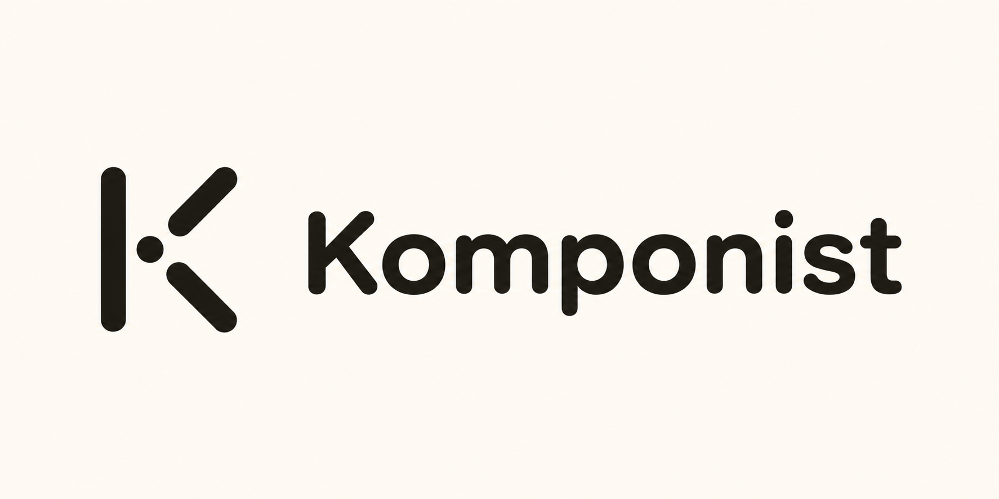

<p align="center">
  
</p>

<h1 align="center">Komponist</h1>

<p align="center">
  <strong>The company brain you own.</strong>
</p>

<p align="center">
  <a href="LICENSE"></a>
  <a href="docker/docker-compose.yml"></a>
</p>

<p align="center">
  <a href="#quick-start">Quick Start</a> •
  <a href="#features">Features</a> •
  <a href="#architecture">Architecture</a> •
  <a href="docs/">Docs</a> •
  <a href="CONTRIBUTING.md">Contributing</a>
</p>

---

Komponist is an open-source, self-hostable company brain for AI agents. Connect your Slack, Notion, and Google Drive to build a cited knowledge graph of your company's goals, decisions, constraints, and context. AI coding assistants query it via MCP to work with full organizational awareness.

## Quick Start

```bash
# Clone and configure
git clone https://github.com/komponist-ai/komponist.git
cd komponist
cp .env.example .env
# Add your API keys to .env

# Start everything
docker compose -f docker/docker-compose.yml up

# Visit http://localhost:3000
```

## Features

- **Self-hosted** — Run on your infrastructure. Your data stays yours.
- **Cited facts** — Every entity links back to source evidence.
- **Human-in-the-loop** — Review and confirm extracted facts before they enter the brain.
- **MCP integration** — AI coding assistants query via standard MCP tools.
- **Data portability** — Export/import your brain as YAML.
- **OpenAI-native AI layer** — Responses API and OpenAI embeddings, with no-network mocks for development.

## How It Works

```
┌─────────────────────────────────────────────────────────────────┐
│                         Your Sources                            │
│  ┌─────────┐  ┌─────────┐  ┌─────────┐  ┌─────────────────┐    │
│  │  Slack  │  │ Notion  │  │ Google  │  │ Local Documents │    │
│  └────┬────┘  └────┬────┘  └────┬────┘  └────────┬────────┘    │
└───────┼────────────┼────────────┼────────────────┼──────────────┘
        │            │            │                │
        └────────────┴─────┬──────┴────────────────┘
                           ▼
                 ┌─────────────────┐
                 │   Extraction    │  LLM extracts goals, decisions,
                 │    Pipeline     │  constraints, customer requests
                 └────────┬────────┘
                          ▼
                 ┌─────────────────┐
                 │  Review Queue   │  You confirm, reject, or edit
                 │    (Web UI)     │  each proposed fact
                 └────────┬────────┘
                          ▼
                 ┌─────────────────┐
                 │  Company Brain  │  Neo4j graph with citations
                 │    (Neo4j)      │  and semantic search
                 └────────┬────────┘
                          ▼
                 ┌─────────────────┐
                 │   MCP Server    │  AI agents query for context
                 └─────────────────┘
```

## Architecture

```
komponist/
├── apps/
│   ├── api/              # FastAPI backend (webhooks, REST, OAuth)
│   ├── mcp/              # MCP server (6 tools for AI agents)
│   └── web/              # Next.js UI (review queue, graph browser)
├── packages/
│   ├── core/             # Graph client, models, LLM/embedding clients
│   ├── pipelines/        # LangGraph extraction pipeline
│   └── sdk-js/           # Typed JavaScript context client
├── docker/               # Docker Compose and Dockerfiles
└── docs/                 # Documentation and design system
```

### Services

| Service | Port | Description |
|---------|------|-------------|
| web | 3000 | Next.js frontend |
| api | 8000 | FastAPI backend |
| mcp | 8080 | MCP server |
| neo4j | 7474, 7687 | Graph database |
| postgres | 5432 | App database |

## MCP Tools

The MCP server exposes six tools to AI coding assistants:

| Tool | Description |
|------|-------------|
| `search_company_context` | Semantic search across the brain |
| `get_active_decisions` | List recent confirmed decisions |
| `check_constraint` | Verify if an action violates constraints |
| `report_result` | Log outcomes back to the brain |
| `request_approval` | Ask for human approval on actions |
| `get_approval_status` | Check pending approval requests |

## JavaScript / TypeScript SDK

Use the reviewed company context directly from trusted server-side code:

```ts
import { createKomponistClient } from '@komponist/sdk'

const komponist = createKomponistClient({
  url: process.env.KOMPONIST_URL ?? 'http://localhost:8000',
  apiKey: process.env.KOMPONIST_API_KEY!,
})

const { data, error } = await komponist.context.search(
  'What did we decide about authentication?',
  { types: ['Decision', 'Constraint'] },
)
```

The same client exposes `brain.info()` and project-scoped `decisions.list()`.
See [`packages/sdk-js`](packages/sdk-js) for the complete contract. Keep API
keys out of browser bundles.

### Claude Code Setup

Add to your MCP configuration:

```json
{
  "mcpServers": {
    "komponist": {
      "command": "docker",
      "args": ["exec", "-i", "komponist-mcp", "python", "-m", "server"]
    }
  }
}
```

Or connect directly:

```json
{
  "mcpServers": {
    "komponist": {
      "url": "http://localhost:8080/mcp",
      "headers": {
        "Authorization": "Bearer ${KOMPONIST_API_KEY}"
      }
    }
  }
}
```

## Configuration

### Environment Variables

```bash
# No key required: deterministic test doubles, not real AI
KOMPONIST_AI_MODE=mock

# Production providers
KOMPONIST_LLM_PROVIDER=openai
KOMPONIST_LLM_MODEL=gpt-5.6-terra
KOMPONIST_OPENAI_STORE=false
KOMPONIST_EMBEDDING_PROVIDER=openai
KOMPONIST_EMBEDDING_MODEL=text-embedding-3-small

# Local documents path
KOMPONIST_LOCAL_DOCS_PATH=./docs

# Leave empty in mock mode
OPENAI_API_KEY=

# OAuth (for connectors)
NOTION_CLIENT_ID=...
NOTION_CLIENT_SECRET=...
GOOGLE_CLIENT_ID=...
GOOGLE_CLIENT_SECRET=...
SLACK_CLIENT_ID=...
SLACK_CLIENT_SECRET=...
```

### Develop Without OpenAI Credits

Mock mode exercises API, extraction-schema, embedding-dimension, and database
contracts without a model or network call. Its hash vectors are deterministic
test data and are **not** suitable for semantic search quality evaluation.

```bash
KOMPONIST_AI_MODE=mock
```

Switch to centrally managed OpenAI calls only after adding a project-scoped key
to the deployment `.env` file. Workspace users never enter or receive this key:

```bash
KOMPONIST_AI_MODE=live
OPENAI_API_KEY=sk-project-key-here
```

When the compose file lives under `docker/`, explicitly load the root file:

```bash
docker compose --env-file .env -f docker/docker-compose.yml up -d
```

Create separate, revocable Komponist access keys for agents under **Settings →
API & MCP**. These keys authorize a single organization; they are not OpenAI
keys.

## Development

### Full stack with web hot reload

Run the normal stack with the web development override:

```bash
docker compose --env-file .env \
  -f docker/docker-compose.yml \
  -f docker/docker-compose.web-dev.yml \
  up -d --build
```

Changes inside `apps/web` now appear at http://localhost:3000 without rebuilding
the image. Next.js dependencies and generated `.next` files stay in Docker
volumes, so they do not overwrite files on the host.

### Run application services locally

```bash
# Start databases only
docker compose -f docker/docker-compose.dev.yml up -d

# Run API locally
cd apps/api && pip install -r requirements.txt && uvicorn main:app --reload

# Run web locally
cd apps/web && pnpm install && pnpm dev
```

See [CONTRIBUTING.md](CONTRIBUTING.md) for the full development guide.

## Documentation

- [Installation Guide](docs/install.md) — MCP setup for Claude Code/Cursor
- [Deployment Guide](docs/deployment.md) — Local and production deployment
- [Architecture Decisions](docs/DECISIONS.md) — ADRs and design rationale
- [Design System](docs/design.md) — UI/UX guidelines
- [FAQ](docs/faq.md) — Common questions answered

## Editions

| Edition | Description | Status |
|---------|-------------|--------|
| **Community** | Open-source, self-hosted | Available |
| **Cloud** | Managed SaaS | Coming soon |
| **Private** | Deploy to your cloud with our support | Contact us |

## Community

- [GitHub Issues](https://github.com/komponist-ai/komponist/issues) — Bug reports and feature requests
- [Discussions](https://github.com/komponist-ai/komponist/discussions) — Questions and ideas

## License

Apache 2.0. See [LICENSE](LICENSE).

---

<p align="center">
  Built with care for teams who want AI agents that understand their business.
</p>
