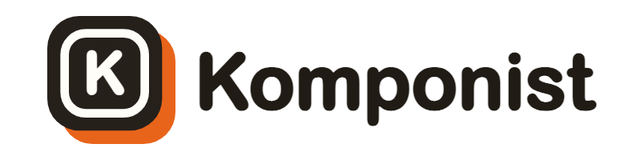
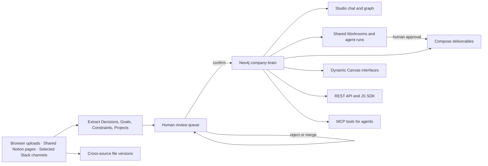

<p align="center">
  <picture>
    <source media="(prefers-color-scheme: dark)" srcset="assets/images/komponist_logo_dark.png">
    <source media="(prefers-color-scheme: light)" srcset="assets/images/komponist_logo_light.png">
    
  </picture>
</p>

<p align="center">
  <strong>The company brain you own.</strong>
</p>

<p align="center">
  <a href="LICENSE"></a>
  <a href="docker/docker-compose.yml"></a>
  <a href="https://github.com/komponist-ai/komponist/actions/workflows/ci.yml"></a>
  <a href="https://komponist.build"></a>
  
</p>

<p align="center">
  <a href="#quick-start">Quick Start</a> ·
  <a href="#what-works-today">Current Status</a> ·
  <a href="#product-capabilities">Capabilities</a> ·
  <a href="#api-sdk-and-mcp">API & MCP</a> ·
  <a href="#development">Development</a> ·
  <a href="https://komponist.build">Website</a>
</p>

---

Komponist is an open-source, self-hostable backend for company context. It
turns documents and connected tools into a reviewed knowledge graph of
**Decisions**, **Goals**, **Constraints**, and **Projects**, keeps exact source
evidence attached, and serves the same confirmed context to people, products,
and AI agents through Studio, REST, a typed JavaScript SDK, and MCP. Its
**Compose** workspace turns that reviewed context into cited presentations,
briefings, and summaries. **Versions** acts as Git for files: it groups likely
revisions across sources, traces editors and timestamps, and compares the
ontology-aligned claims beneath each document.

**Workrooms** give people and agents a shared objective, approved plan,
permission-scoped context, durable execution, conversation, and cited
deliverables. **Canvas** turns a question into a validated live interface over
the graph, resolved separately for every viewer's permissions.

> [!IMPORTANT]
> Komponist is currently a self-hostable MVP, not a production-ready managed
> cloud service. The complete document → review → graph → cited chat/API/MCP
> loop is verified locally. The production Compose stack has also been deployed
> as a public HTTPS pilot on a single Ubuntu server through Coolify, including
> persistent PostgreSQL and Neo4j services. Real connector lifecycles, external
> MCP hosts, backup restoration, and production operations still need
> end-to-end validation. See the
> [detailed MVP status](docs/MVP_STATUS.md).

## Quick Start

### Prerequisites

- Docker Desktop with Docker Compose
- Git
- An OpenAI API key only when using live AI mode

### 1. Configure Komponist

```bash
git clone https://github.com/komponist-ai/komponist.git
cd komponist
cp .env.example .env
```

For a provider-free local test, set these values in `.env`:

```dotenv
KOMPONIST_AI_MODE=mock
KOMPONIST_SECRET_KEY=replace-with-a-long-random-secret
OPENAI_API_KEY=
```

Mock mode makes no model or AI-provider network calls. It uses deterministic
test doubles, so it is suitable for testing workflows but not answer quality or
semantic retrieval quality.

For real extraction, embeddings, and grounded chat, use centrally managed
OpenAI credentials instead:

```dotenv
KOMPONIST_AI_MODE=live
KOMPONIST_LLM_PROVIDER=openai
KOMPONIST_EMBEDDING_PROVIDER=openai
OPENAI_API_KEY=sk-project-key-here
```

Workspace members never enter their own AI-provider keys. In live mode,
relevant document and query content is sent to the configured OpenAI models.

### 2. Start the stack

```bash
docker compose --env-file .env -f docker/docker-compose.yml up -d --build --wait
```

The commands in this README use Docker Compose v2. If your Docker Desktop
installation only exposes the legacy standalone command, use this equivalent
instead (Compose v1 does not support `--wait`):

```bash
docker-compose --env-file .env -f docker/docker-compose.yml up -d --build
```

| Service | URL | Purpose |
| --- | --- | --- |
| Web | http://localhost:3000 | Landing page and Komponist Studio |
| API | http://localhost:8000 | REST API and OpenAPI docs at `/docs` |
| MCP | http://localhost:8080/mcp | Authenticated Streamable HTTP MCP server |
| Neo4j | http://localhost:7474 | Local graph database browser |
| Postgres | `localhost:5432` | Application and governance data |

### 3. Test the core loop

1. Open http://localhost:3000/studio and create an account with email and a
   password of at least 12 characters.
2. Open **Add Source → Upload Documents** and upload the 14 numbered files in
   [`test-data/upload/campuskollektiv`](test-data/upload/campuskollektiv). They
   form one realistic fictional student-association workspace with board
   decisions, departments, budgets, confidential access rules, dependencies,
   and competing document versions.
3. Confirm or reject the extracted facts in **Review Queue**.
4. Inspect confirmed entities and relationships in **Graph**.
5. Ask a question in **Chat** and inspect the attached evidence.
6. Open **Compose** to create a cited PowerPoint deck, briefing, or summary.
7. Create a **Workroom**, approve its generated plan, and let the durable worker
   research a task against the same confirmed graph.
8. Ask **Canvas** for a live interface such as “show projects at risk and the
   decisions blocking them”.
9. Open **Versions** to try the built-in three-platform example or compare
   related documents from your own sources.
10. Create an organization-scoped key under **Settings → API & MCP** when you
   want to connect server-side code or an agent.

> [!NOTE]
> All companies, people, timelines, metrics, URLs, and events in
> `test-data`, `docs/demo`, and built-in product examples are fictional and
> exist only to demonstrate and test Komponist.

To record the same CampusKollektiv flow as a repeatable product video, use the
Playwright + Remotion package in
[`apps/demo-video`](apps/demo-video/README.md). It installs a stable showcase,
captures Sources, cited Chat, Canvas, Workrooms, and Compose from the real app,
then renders a captioned 88-second video with an optional voice-over.

Stop the stack with:

```bash
docker compose --env-file .env -f docker/docker-compose.yml down
```

## What Works Today

| Area | Current state |
| --- | --- |
| Local core loop | Verified end-to-end in Docker: upload or scan documents, extract facts, review them, browse the graph, and receive cited answers |
| Web application | Landing page, authentication, cited chat, shared Workrooms, Compose, Canvas, file version intelligence, chat history, review queue, scalable entities/sources, interactive graph explorer, team/departments, AI status, API keys, and export UI |
| Authentication | Email/password registration and login, revocable HttpOnly sessions, invitations, organization switching, and provider-free Google login contracts |
| Authorization | Organization isolation, owner/admin/member/viewer roles, department assignments, read/write checks, and encrypted connector configuration |
| Chat | Confirmed-context retrieval, streaming answers, evidence cards, graph expansion, dynamic suggestions, and persistent multi-chat history |
| Workrooms | Shared rooms with room roles and visibility modes, model-generated approved plans, governed context packs, a shared conversation, durable agent execution in a separate worker, and deliverables shared with room participants |
| Canvas | Model-described, server-validated dashboards over confirmed knowledge: closed component and query vocabulary, per-viewer permission resolution, cited facts, conversational refinement, and version history |
| Compose | Permission-aware presentations, briefings, and summaries with private history, inline citations, designed PDF, editable PowerPoint, and Markdown export |
| Versions | Cross-source document families, provenance timelines, latest-candidate ranking, semantic claim diffs, conflict preservation, and a built-in three-platform example |
| API and SDK | Organization API keys plus `/v1/context`, `/v1/brain`, `/v1/decisions`, and the typed `@komponist/sdk` workspace package |
| MCP | Six authenticated tools and the `company-brain://info` resource verified through a real FastMCP client |
| CI | Provider-free Python contracts, web lint/build, SDK build/tests, and a full Docker end-to-end suite in GitHub Actions |
| Deployment | Production Compose stack deployed through Coolify on a single Ubuntu pilot server with HTTPS routing, health checks, and persistent PostgreSQL/Neo4j storage |

### Still unverified or missing

- Slack OAuth and selected-channel sync have been exercised in a real workspace.
  High-volume history, every attachment type, real-time event delivery, and
  signed interaction callbacks still need broader live validation
- Google Drive, GitHub, and Linear are not exposed as product connectors
  until their provider flows meet the same end-to-end bar
- Notion internal-integration sync is implemented and has been exercised
  manually; nested-page, partial-failure, extraction, and department-scope
  behavior also have provider-free contracts, but large live workspaces still
  need sustained testing
- Google user sign-in with production credentials
- Live OpenAI extraction; live grounded chat and offline OpenAI request contracts
  have been tested separately
- Claude Code, Codex, Cursor, or another external MCP host connected to the
  running server
- Off-server backup restoration, disaster recovery, upgrade rehearsal,
  monitoring, and alerting for the public pilot
- Password reset, personal account settings, organization create/rename UI,
  billing, quotas, error tracking, and operational dashboards
- Live participant presence, email room invitations, agent-to-agent handoffs,
  parallel task execution, and multiple specialized agents; Workrooms currently
  run one Analyst, though it now executes in a durable worker rather than in
  the API process
- Live OpenAI plan generation with production credentials; plan generation is
  verified through the provider abstraction offline, and an opt-in live check
  exists but is not part of CI
- Department-scoped programmatic keys; API and MCP keys currently authorize the
  complete organization brain

## Product Capabilities

### Reviewed company knowledge

- Extracts only the current MVP entity types: Decision, Goal, Constraint, and
  Project.
- Keeps source, reference, excerpt, URL, and source date as Evidence.
- Sends every extracted fact to a review queue by default.
- Supports confirm, reject, edit-on-confirm, and merge lifecycle actions.
- Stores confirmed entities and relationships in Neo4j.
- Lists entities with accurate status/type counts and one-hop neighborhoods.
- Provides an interactive graph explorer with text search, entity/status
  filters, neighborhood focus, relationship inspection, evidence and degree
  metadata, fullscreen navigation, and JSON export.
- Exports a portable YAML snapshot; YAML import is available through the API.

### Grounded chat

- Searches only confirmed knowledge visible to the signed-in member.
- Combines literal retrieval, semantic retrieval in live mode, and graph context.
- Streams answers with citations instead of returning detached prose.
- Handles aggregate questions such as entity counts without hard-coded
  organization-specific answers.
- Generates example questions from the current graph.

### Compose deliverables

- Creates presentations, executive briefings, and summaries from confirmed,
  cited graph knowledge visible to the signed-in member.
- Keeps generated history private per member and revokes cached deliverables
  when department access changes.
- Shows source references in the preview and exports designed PDFs, editable
  `.pptx` decks, or portable Markdown documents with an evidence appendix.
- Uses the configured AI model in live mode and a deterministic grounded
  template in provider-free mock mode.
- Persists multiple conversations with rename and delete support.

### Multiplayer Workrooms

- Creates shared rooms around one objective, with explicit participants holding
  an **owner**, **editor**, **approver**, or **viewer** role, and a visibility
  mode of organization, departments, or private.
- Proposes a structured plan through the configured model using strict
  structured outputs, then re-validates it locally — unique keys, resolvable
  dependencies, no cycles — and requires human approval before it becomes the
  active plan. Plans are versioned rather than overwritten.
- Runs one **Komponist Analyst** against confirmed graph knowledge only. Room
  membership never widens knowledge access: the agent reads the room's scope,
  never the unrestricted access of whoever started it.
- Lets a room pin or exclude specific sources, and shows a permission-safe
  preview of exactly what the agent may read. Sources the room cannot reach are
  reported as a count, never named.
- Records an immutable per-run snapshot of the entities, evidence, excerpts,
  source links, and permission scope behind every result.
- Executes agent work in a **separate worker process** backed by a Postgres
  queue, so queued and in-flight runs survive an API restart or redeploy.
- Supports pause, resume, cancel, retry, and versioned redirects. Pause and
  cancel take effect at the next safe step, because a model request already in
  flight cannot be interrupted — the UI says so rather than implying otherwise.
- Keeps a shared conversation for humans and the agent, separate from the
  immutable activity trail. A message never commands the agent; redirecting is
  an explicit action.
- Shares approved deliverables with room participants through room
  authorization, while deliverables with no room link stay private to their
  creator.

Run at least one worker (`python worker.py`, or the `worker` Compose service)
whenever Workrooms are in use. Without it, runs are stored durably but never
execute, and `/healthz` reports `workroom_worker.workers_online: 0`.

### Canvas

- Turns a described view — "a pilot dashboard with milestones, risks and
  evidence" — into a working, cited interface assembled from approved
  building blocks.
- The model writes only a declarative specification. It never produces
  JavaScript, JSX, HTML, SQL or Cypher, and the server owns every query.
- Components and queries come from a closed vocabulary; filters are typed
  triples over allowlisted fields whose values reach Neo4j only as bound
  parameters. An unknown component renders a controlled error and executes
  nothing.
- No component may carry a URL, so a generated view cannot make an outbound
  request or leak a viewer's IP through a remote image.
- A Canvas stores a question, not an answer: data is resolved against each
  viewer's own permissions, so a shared view legitimately shows different
  numbers to different people and never leaks across departments.
- Prose is only allowed where it names the confirmed facts it rests on.
- Refinement by chat appends a version; earlier versions stay renderable and
  restorable.
- Read-only in this slice: no actions, no data changes, no external calls.

### Git for files

- Persists each newly ingested revision as a content-addressed
  `DocumentVersion` in Neo4j with source, editor, edit time, and department
  provenance.
- Groups versions using exact content hashes, normalized names, and overlap
  between ontology-aligned graph claims.
- Shows an evidence-backed **latest candidate** rather than presenting recency
  as unquestioned truth.
- Compares the oldest and newest claims, identifies additions/removals and
  likely semantic changes, and keeps contradictions explicitly unresolved.
- Includes a model-free Notion → Google Drive → browser upload example directly
  in Studio so the workflow can be evaluated before connecting a provider.

This is an MVP matcher, not a collaborative binary-file editor or a general
three-way merge engine. Ambiguous families and conflicting claims still require
human review.

### Sources

| Source | Interface | Validation status |
| --- | --- | --- |
| Browser upload | Markdown, text, YAML, and YML | Locally verified |
| Notion | Internal Integration token, explicitly shared pages, nested block sync, document inspection | Manually exercised; provider-free scope, pagination, partial-failure, and extraction contracts passing |
| Slack | OAuth, explicit channel allowlist, complete thread sync, PDF/DOCX/PPTX/text attachment ingestion, document inspection | Workspace install/channel discovery exercised; provider-free thread, attachment, event-scope, and extraction contracts passing |

Synced documents can be inspected, moved between department scopes, or deleted
from Komponist without deleting the original item on its provider. Connected
sources can define a default department for future items.

To connect Notion, create an **Internal Integration** at
`notion.so/my-integrations`, share only the intended pages through
**••• → Connections**, then paste its `ntn_…` or legacy `secret_…` token in
**Sources → Add source → Notion**. No deployment-level Notion OAuth variables
are required for this internal-token path. A sync discovers the shared pages,
reads nested blocks, and sends extracted facts into the normal review workflow.

### Organizations, roles, and departments

| Role | Access |
| --- | --- |
| Owner | All organization and department knowledge; manages admins, members, departments, settings, keys, and exports |
| Admin | All organization and department knowledge; manages non-owner team members, departments, settings, keys, and exports |
| Member | Reads organization-wide and assigned-department knowledge; reviews and adds knowledge within the permitted scope |
| Viewer | Read-only access to organization-wide knowledge plus knowledge in assigned departments |

Organization-wide knowledge is visible to every active organization member.
Department-scoped knowledge is visible to owners/admins and members/viewers
assigned to at least one matching department. Uploads can be scoped per
document; connector items inherit their source's default department. Changing a
member's scope clears their stored chat history so earlier answers cannot retain
newly inaccessible context.

> [!WARNING]
> Organization API keys and MCP keys are currently organization-wide. Treat
> them as server secrets and do not expose them to department-limited users or
> browser bundles.

## How It Works



Postgres stores users, sessions, organization memberships, departments,
invitations, connected-source configuration, chat history, Workrooms, tasks,
agent runs and events, API keys, approvals, and MCP tool-call records. Neo4j
stores entities, evidence, and relationships.

## API, SDK, and MCP

### REST API

Create a revocable key in **Settings → API & MCP**, then call the stable
server-to-server surface:

```bash
curl --get http://localhost:8000/v1/context \
  --header "Authorization: Bearer $KOMPONIST_API_KEY" \
  --data-urlencode "query=What did we decide about authentication?" \
  --data-urlencode "types=Decision" \
  --data-urlencode "types=Constraint"
```

| Endpoint | Purpose |
| --- | --- |
| `GET /v1/context` | Search confirmed, cited Decisions, Goals, Constraints, and Projects |
| `GET /v1/brain` | Return confirmed/pending totals and confirmed counts by type |
| `GET /v1/decisions` | List active cited decisions, optionally scoped to a project |

The browser application uses additional session-authenticated endpoints. The
complete generated contract is available at http://localhost:8000/docs.

### JavaScript / TypeScript SDK

The repository contains a typed client in [`packages/sdk-js`](packages/sdk-js):

```ts
import { createKomponistClient } from '@komponist/sdk'

const komponist = createKomponistClient({
  url: process.env.KOMPONIST_URL ?? 'http://localhost:8000',
  apiKey: process.env.KOMPONIST_API_KEY!,
})

const { data, error } = await komponist.context.search(
  'What did we decide about authentication?',
  { types: ['Decision', 'Constraint'], limit: 8 },
)

if (error) throw new Error(error.message)
console.log(data.items[0]?.evidence)
```

The same client exposes `brain.info()` and project-scoped
`decisions.list({ projectId })`. It currently ships as a workspace package in
this repository; an npm release is not part of the verified MVP.

### MCP

The Streamable HTTP endpoint is `http://localhost:8080/mcp` and requires the
same organization API key as a Bearer token. For clients using Codex-style TOML:

```toml
[mcp_servers.komponist]
url = "http://localhost:8080/mcp"
bearer_token_env_var = "KOMPONIST_API_KEY"
```

Client configuration syntax varies. External-host interoperability is still an
explicit MVP validation item even though authenticated discovery and every tool
contract pass against a FastMCP client.

| Tool or resource | Purpose |
| --- | --- |
| `search_company_context` | Search confirmed organization context with evidence |
| `get_active_decisions` | List current decisions, optionally by topic/project |
| `report_result` | Create idempotent agent-report Decision proposals for review |
| `check_constraint` | Return allow, block, or approval-required verdicts |
| `request_approval` | Persist a human approval request |
| `get_approval_status` | Read the current approval decision |
| `company-brain://info` | Return compact confirmed/pending brain metadata |

## Architecture

```text
komponist/
├── apps/
│   ├── api/              # FastAPI, auth, REST, chat, connectors, persistence
│   ├── mcp/              # Authenticated FastMCP server and six agent tools
│   └── web/              # Next.js 14 Studio and landing page
├── packages/
│   ├── core/             # Graph queries, models, OpenAI and embedding clients
│   ├── pipelines/        # LangGraph extraction and work-pack pipelines
│   └── sdk-js/           # Typed company-context client
├── docker/               # Full, development, hot-reload, and CI Compose files
├── deploy/               # Hetzner/Coolify pilot runbook and deployment checks
├── scripts/ci/           # Provider-free end-to-end test runner
├── test-data/upload/     # Ready-to-upload MVP test documents
└── docs/                 # Status, deployment, design, FAQ, and decisions
```

| Service | Port | Main responsibility |
| --- | --- | --- |
| Web | 3000 | Next.js Studio, landing page, and browser session flows |
| API | 8000 | FastAPI application, extraction orchestration, chat, REST, OAuth/webhooks |
| MCP | 8080 | Authenticated FastMCP Streamable HTTP server |
| Neo4j | 7474 / 7687 | Entity, Evidence, and relationship graph |
| Postgres | 5432 | Identity, configuration, governance, history, and audit data |

## Configuration

The complete configuration reference lives in [`.env.example`](.env.example).
The most important values are:

| Variable | Purpose |
| --- | --- |
| `KOMPONIST_AI_MODE` | `mock` for deterministic no-network AI doubles; `live` for configured providers |
| `OPENAI_API_KEY` | Centrally managed key used only in live mode |
| `KOMPONIST_LLM_MODEL` | OpenAI model used for extraction, planning, and generation |
| `KOMPONIST_EMBEDDING_MODEL` | Embedding model; the graph index expects 1536 dimensions |
| `KOMPONIST_OPENAI_STORE` | Controls OpenAI Responses API application-state retention; defaults to `false` |
| `KOMPONIST_SECRET_KEY` | Stable secret used to encrypt connector credentials in Postgres |
| `KOMPONIST_LOCAL_DOCS_HOST_PATH` | Host folder mounted read-only for local-document scanning |
| `GOOGLE_AUTH_CLIENT_ID` / `GOOGLE_AUTH_CLIENT_SECRET` | Optional Google account login credentials |
| `NOTION_*`, `SLACK_*`, `GOOGLE_*` | Optional connector OAuth credentials |
| `GITHUB_WEBHOOK_SECRET`, `LINEAR_WEBHOOK_SECRET` | Webhook signature secrets |

The supported product modes are deterministic mock mode and centrally managed
OpenAI live mode. Anthropic/Ollama adapters in the core package are experimental
and are not wired through the current Studio configuration or verified Docker
runtime.

## Development

### Full stack with web hot reload

```bash
docker compose --env-file .env \
  -f docker/docker-compose.yml \
  -f docker/docker-compose.web-dev.yml \
  up -d --build
```

Changes under `apps/web` appear at http://localhost:3000 without rebuilding the
container. Linux dependencies and `.next` output remain in Docker volumes.

### Run application services locally

Use Python 3.12 and Node.js 20 to match CI:

```bash
# Infrastructure
docker compose -f docker/docker-compose.dev.yml up -d

# Python environment
python3.12 -m venv .venv
source .venv/bin/activate
python -m pip install -e packages/core -e packages/pipelines \
  -r apps/api/requirements.txt -r apps/mcp/requirements.txt \
  -r packages/core/test-requirements.txt

# API (terminal 1)
cd apps/api && uvicorn main:app --reload

# Web (terminal 2, from the repository root)
npm --prefix apps/web ci
npm --prefix apps/web run dev

# MCP over HTTP (terminal 3, from the repository root)
cd apps/mcp && fastmcp run server.py:mcp \
  --transport http --host 0.0.0.0 --port 8080
```

See [CONTRIBUTING.md](CONTRIBUTING.md) for contribution conventions.

### Tests

```bash
# Provider-free Python contracts (after installing the Python environment above)
python -m pytest -q \
  packages/core/tests/test_ai_clients.py \
  packages/pipelines/tests/test_contracts.py \
  packages/pipelines/tests/test_document_relationships.py

# Web
npm --prefix apps/web ci
npm --prefix apps/web run lint
npm --prefix apps/web run build

# SDK
npm --prefix packages/sdk-js ci
npm --prefix packages/sdk-js run build
npm --prefix packages/sdk-js test
```

Run the same provider-free Docker suite used by CI:

```bash
docker compose \
  -f docker/docker-compose.yml \
  -f docker/docker-compose.ci.yml \
  up -d --build --wait --wait-timeout 240

bash scripts/ci/run-e2e.sh

docker compose \
  -f docker/docker-compose.yml \
  -f docker/docker-compose.ci.yml \
  down --volumes --remove-orphans
```

## Documentation

- [MVP Status](docs/MVP_STATUS.md) — verified behavior, open boundaries, and next steps
- [MCP Installation](docs/install.md) — agent-client setup and tool usage
- [Deployment Guide](docs/deployment.md) — local setup and production overview
- [Hetzner + Coolify Runbook](deploy/hetzner/README.md) — pilot server, DNS, secrets, verification, and recovery
- [Architecture Decisions](docs/DECISIONS.md) — ADRs and design rationale
- [Design System](docs/design.md) — product UI conventions
- [FAQ](docs/faq.md) — common questions

## Editions

| Edition | State |
| --- | --- |
| Community | Source available under Apache 2.0; local Docker stack verified on the development Mac |
| Cloud | Planned; the current public instance is a private pilot, not a managed multi-tenant cloud product |
| Private deployment | Single-server Ubuntu/Coolify pilot deployed with HTTPS and persistent databases; backup recovery and production operations remain to be validated |

## Contributing

Issues and pull requests are welcome. Please read
[CONTRIBUTING.md](CONTRIBUTING.md) and use Conventional Commits.

## License

The software and documentation are available under the
[Apache License 2.0](LICENSE). Attribution information is collected in
[NOTICE](NOTICE). The Komponist name and logos are governed separately by the
[trademark policy](TRADEMARKS.md).

---

<p align="center">
  Built for teams who want AI agents to understand the business without guessing.
</p>
