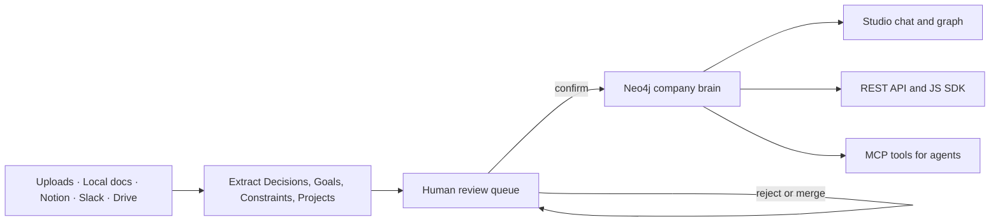

<p align="center">
  
</p>

<h1 align="center">Komponist</h1>

<p align="center">
  <strong>The company brain you own.</strong>
</p>

<p align="center">
  <a href="LICENSE"></a>
  <a href="docker/docker-compose.yml"></a>
  <a href="https://github.com/komponist-ai/komponist/actions/workflows/ci.yml"></a>
  
</p>

<p align="center">
  <a href="#quick-start">Quick Start</a> ·
  <a href="#what-works-today">Current Status</a> ·
  <a href="#product-capabilities">Capabilities</a> ·
  <a href="#api-sdk-and-mcp">API & MCP</a> ·
  <a href="#development">Development</a>
</p>

---

Komponist is an open-source, self-hostable backend for company context. It
turns documents and connected tools into a reviewed knowledge graph of
**Decisions**, **Goals**, **Constraints**, and **Projects**, keeps exact source
evidence attached, and serves the same confirmed context to people, products,
and AI agents through Studio, REST, a typed JavaScript SDK, and MCP. Its
**Compose** workspace turns that reviewed context into cited presentations,
briefings, and summaries.

> [!IMPORTANT]
> Komponist is currently a local-first MVP, not a production-ready hosted
> service. The complete local document → review → graph → cited chat/API/MCP
> loop is verified. Real connector lifecycles, external MCP hosts, clean-machine
> installation, and cloud deployment still need end-to-end validation. See the
> [detailed MVP status](docs/MVP_STATUS.md).

## Quick Start

### Prerequisites

- Docker Desktop with Docker Compose
- Git
- An OpenAI API key only when using live AI mode

### 1. Configure Komponist

```bash
git clone https://github.com/komponist-ai/komponist.git
cd komponist
cp .env.example .env
```

For a provider-free local test, set these values in `.env`:

```dotenv
KOMPONIST_AI_MODE=mock
KOMPONIST_SECRET_KEY=replace-with-a-long-random-secret
OPENAI_API_KEY=
```

Mock mode makes no model or AI-provider network calls. It uses deterministic
test doubles, so it is suitable for testing workflows but not answer quality or
semantic retrieval quality.

For real extraction, embeddings, and grounded chat, use centrally managed
OpenAI credentials instead:

```dotenv
KOMPONIST_AI_MODE=live
KOMPONIST_LLM_PROVIDER=openai
KOMPONIST_EMBEDDING_PROVIDER=openai
OPENAI_API_KEY=sk-project-key-here
```

Workspace members never enter their own AI-provider keys. In live mode,
relevant document and query content is sent to the configured OpenAI models.

### 2. Start the stack

```bash
docker compose --env-file .env -f docker/docker-compose.yml up -d --build --wait
```

The commands in this README use Docker Compose v2. If your Docker Desktop
installation only exposes the legacy standalone command, use this equivalent
instead (Compose v1 does not support `--wait`):

```bash
docker-compose --env-file .env -f docker/docker-compose.yml up -d --build
```

| Service | URL | Purpose |
| --- | --- | --- |
| Web | http://localhost:3000 | Landing page and Komponist Studio |
| API | http://localhost:8000 | REST API and OpenAPI docs at `/docs` |
| MCP | http://localhost:8080/mcp | Authenticated Streamable HTTP MCP server |
| Neo4j | http://localhost:7474 | Local graph database browser |
| Postgres | `localhost:5432` | Application and governance data |

### 3. Test the core loop

1. Open http://localhost:3000/studio and create an account with email and a
   password of at least 12 characters.
2. Open **Add Source → Upload Documents** and upload the files in
   [`test-data/upload`](test-data/upload).
3. Confirm or reject the extracted facts in **Review Queue**.
4. Inspect confirmed entities and relationships in **Graph**.
5. Ask a question in **Chat** and inspect the attached evidence.
6. Open **Compose** to create a cited PowerPoint deck, briefing, or summary.
7. Create an organization-scoped key under **Settings → API & MCP** when you
   want to connect server-side code or an agent.

Stop the stack with:

```bash
docker compose --env-file .env -f docker/docker-compose.yml down
```

## What Works Today

| Area | Current state |
| --- | --- |
| Local core loop | Verified end-to-end in Docker: upload or scan documents, extract facts, review them, browse the graph, and receive cited answers |
| Web application | Landing page, authentication, Studio chat, Compose, chat history, review queue, entities, graph, sources, team/departments, AI status, API keys, and export UI |
| Authentication | Email/password registration and login, revocable HttpOnly sessions, invitations, organization switching, and provider-free Google login contracts |
| Authorization | Organization isolation, owner/admin/member/viewer roles, department assignments, read/write checks, and encrypted connector configuration |
| Chat | Confirmed-context retrieval, streaming answers, evidence cards, graph expansion, dynamic suggestions, and persistent multi-chat history |
| Compose | Permission-aware presentations, briefings, and summaries with private history, inline citations, designed PDF, editable PowerPoint, and Markdown export |
| API and SDK | Organization API keys plus `/v1/context`, `/v1/brain`, `/v1/decisions`, and the typed `@komponist/sdk` workspace package |
| MCP | Six authenticated tools and the `company-brain://info` resource verified through a real FastMCP client |
| CI | Provider-free Python contracts, web lint/build, SDK build/tests, and a full Docker end-to-end suite in GitHub Actions |

### Still unverified or missing

- Real Notion, Slack, and Google connector OAuth/token-refresh lifecycles
- Real GitHub, Linear, Slack, and Google webhook delivery
- Google user sign-in with production credentials
- Live OpenAI extraction; live grounded chat and offline OpenAI request contracts
  have been tested separately
- Claude Code, Codex, Cursor, or another external MCP host connected to the
  running server
- Clean-machine self-hosting and any public cloud deployment
- Password reset, personal account settings, organization create/rename UI,
  billing, quotas, error tracking, and operational dashboards
- Department-scoped programmatic keys; API and MCP keys currently authorize the
  complete organization brain

## Product Capabilities

### Reviewed company knowledge

- Extracts only the current MVP entity types: Decision, Goal, Constraint, and
  Project.
- Keeps source, reference, excerpt, URL, and source date as Evidence.
- Sends every extracted fact to a review queue by default.
- Supports confirm, reject, edit-on-confirm, and merge lifecycle actions.
- Stores confirmed entities and relationships in Neo4j.
- Lists entities with accurate status/type counts and one-hop neighborhoods.
- Exports a portable YAML snapshot; YAML import is available through the API.

### Grounded chat

- Searches only confirmed knowledge visible to the signed-in member.
- Combines literal retrieval, semantic retrieval in live mode, and graph context.
- Streams answers with citations instead of returning detached prose.
- Handles aggregate questions such as entity counts without hard-coded
  organization-specific answers.
- Generates example questions from the current graph.

### Compose deliverables

- Creates presentations, executive briefings, and summaries from confirmed,
  cited graph knowledge visible to the signed-in member.
- Keeps generated history private per member and revokes cached deliverables
  when department access changes.
- Shows source references in the preview and exports designed PDFs, editable
  `.pptx` decks, or portable Markdown documents with an evidence appendix.
- Uses the configured AI model in live mode and a deterministic grounded
  template in provider-free mock mode.
- Persists multiple conversations with rename and delete support.

### Sources

| Source | Interface | Validation status |
| --- | --- | --- |
| Browser upload | Markdown, text, YAML, and YML | Locally verified |
| Mounted local folder | Configurable scan path and extensions | Locally verified |
| Notion | Integration token/OAuth, page sync, document inspection | Implemented; real provider flow unverified |
| Slack | OAuth and signed webhook ingestion | Implemented; real provider flow unverified |
| Google Drive | OAuth and protected webhook ingestion | Implemented; real provider flow unverified |
| GitHub | Signed webhook ingestion | Backend implemented; no Studio connector yet |
| Linear | Signed webhook ingestion | Backend implemented; no Studio connector yet |

Synced documents can be inspected, moved between department scopes, or deleted
from Komponist without deleting the original item on its provider. Connected
sources can define a default department for future items.

### Organizations, roles, and departments

| Role | Access |
| --- | --- |
| Owner | All organization and department knowledge; manages admins, members, departments, settings, keys, and exports |
| Admin | All organization and department knowledge; manages non-owner team members, departments, settings, keys, and exports |
| Member | Reads organization-wide and assigned-department knowledge; reviews and adds knowledge within the permitted scope |
| Viewer | Read-only access to organization-wide knowledge plus knowledge in assigned departments |

Organization-wide knowledge is visible to every active organization member.
Department-scoped knowledge is visible to owners/admins and members/viewers
assigned to at least one matching department. Uploads can be scoped per
document; connector items inherit their source's default department. Changing a
member's scope clears their stored chat history so earlier answers cannot retain
newly inaccessible context.

> [!WARNING]
> Organization API keys and MCP keys are currently organization-wide. Treat
> them as server secrets and do not expose them to department-limited users or
> browser bundles.

## How It Works



Postgres stores users, sessions, organization memberships, departments,
invitations, connected-source configuration, chat history, API keys, approvals,
and MCP tool-call records. Neo4j stores entities, evidence, and relationships.

## API, SDK, and MCP

### REST API

Create a revocable key in **Settings → API & MCP**, then call the stable
server-to-server surface:

```bash
curl --get http://localhost:8000/v1/context \
  --header "Authorization: Bearer $KOMPONIST_API_KEY" \
  --data-urlencode "query=What did we decide about authentication?" \
  --data-urlencode "types=Decision" \
  --data-urlencode "types=Constraint"
```

| Endpoint | Purpose |
| --- | --- |
| `GET /v1/context` | Search confirmed, cited Decisions, Goals, Constraints, and Projects |
| `GET /v1/brain` | Return confirmed/pending totals and confirmed counts by type |
| `GET /v1/decisions` | List active cited decisions, optionally scoped to a project |

The browser application uses additional session-authenticated endpoints. The
complete generated contract is available at http://localhost:8000/docs.

### JavaScript / TypeScript SDK

The repository contains a typed client in [`packages/sdk-js`](packages/sdk-js):

```ts
import { createKomponistClient } from '@komponist/sdk'

const komponist = createKomponistClient({
  url: process.env.KOMPONIST_URL ?? 'http://localhost:8000',
  apiKey: process.env.KOMPONIST_API_KEY!,
})

const { data, error } = await komponist.context.search(
  'What did we decide about authentication?',
  { types: ['Decision', 'Constraint'], limit: 8 },
)

if (error) throw new Error(error.message)
console.log(data.items[0]?.evidence)
```

The same client exposes `brain.info()` and project-scoped
`decisions.list({ projectId })`. It currently ships as a workspace package in
this repository; an npm release is not part of the verified MVP.

### MCP

The Streamable HTTP endpoint is `http://localhost:8080/mcp` and requires the
same organization API key as a Bearer token. For clients using Codex-style TOML:

```toml
[mcp_servers.komponist]
url = "http://localhost:8080/mcp"
bearer_token_env_var = "KOMPONIST_API_KEY"
```

Client configuration syntax varies. External-host interoperability is still an
explicit MVP validation item even though authenticated discovery and every tool
contract pass against a FastMCP client.

| Tool or resource | Purpose |
| --- | --- |
| `search_company_context` | Search confirmed organization context with evidence |
| `get_active_decisions` | List current decisions, optionally by topic/project |
| `report_result` | Create idempotent agent-report Decision proposals for review |
| `check_constraint` | Return allow, block, or approval-required verdicts |
| `request_approval` | Persist a human approval request |
| `get_approval_status` | Read the current approval decision |
| `company-brain://info` | Return compact confirmed/pending brain metadata |

## Architecture

```text
komponist/
├── apps/
│   ├── api/              # FastAPI, auth, REST, chat, connectors, persistence
│   ├── mcp/              # Authenticated FastMCP server and six agent tools
│   └── web/              # Next.js 14 Studio and landing page
├── packages/
│   ├── core/             # Graph queries, models, OpenAI and embedding clients
│   ├── pipelines/        # LangGraph extraction and work-pack pipelines
│   └── sdk-js/           # Typed company-context client
├── docker/               # Full, development, hot-reload, and CI Compose files
├── scripts/ci/           # Provider-free end-to-end test runner
├── test-data/upload/     # Ready-to-upload MVP test documents
└── docs/                 # Status, deployment, design, FAQ, and decisions
```

| Service | Port | Main responsibility |
| --- | --- | --- |
| Web | 3000 | Next.js Studio, landing page, and browser session flows |
| API | 8000 | FastAPI application, extraction orchestration, chat, REST, OAuth/webhooks |
| MCP | 8080 | Authenticated FastMCP Streamable HTTP server |
| Neo4j | 7474 / 7687 | Entity, Evidence, and relationship graph |
| Postgres | 5432 | Identity, configuration, governance, history, and audit data |

## Configuration

The complete configuration reference lives in [`.env.example`](.env.example).
The most important values are:

| Variable | Purpose |
| --- | --- |
| `KOMPONIST_AI_MODE` | `mock` for deterministic no-network AI doubles; `live` for configured providers |
| `OPENAI_API_KEY` | Centrally managed key used only in live mode |
| `KOMPONIST_LLM_MODEL` | OpenAI model used for extraction, planning, and generation |
| `KOMPONIST_EMBEDDING_MODEL` | Embedding model; the graph index expects 1536 dimensions |
| `KOMPONIST_OPENAI_STORE` | Controls OpenAI Responses API application-state retention; defaults to `false` |
| `KOMPONIST_SECRET_KEY` | Stable secret used to encrypt connector credentials in Postgres |
| `KOMPONIST_LOCAL_DOCS_HOST_PATH` | Host folder mounted read-only for local-document scanning |
| `GOOGLE_AUTH_CLIENT_ID` / `GOOGLE_AUTH_CLIENT_SECRET` | Optional Google account login credentials |
| `NOTION_*`, `SLACK_*`, `GOOGLE_*` | Optional connector OAuth credentials |
| `GITHUB_WEBHOOK_SECRET`, `LINEAR_WEBHOOK_SECRET` | Webhook signature secrets |

The supported product modes are deterministic mock mode and centrally managed
OpenAI live mode. Anthropic/Ollama adapters in the core package are experimental
and are not wired through the current Studio configuration or verified Docker
runtime.

## Development

### Full stack with web hot reload

```bash
docker compose --env-file .env \
  -f docker/docker-compose.yml \
  -f docker/docker-compose.web-dev.yml \
  up -d --build
```

Changes under `apps/web` appear at http://localhost:3000 without rebuilding the
container. Linux dependencies and `.next` output remain in Docker volumes.

### Run application services locally

Use Python 3.12 and Node.js 20 to match CI:

```bash
# Infrastructure
docker compose -f docker/docker-compose.dev.yml up -d

# Python environment
python3.12 -m venv .venv
source .venv/bin/activate
python -m pip install -e packages/core -e packages/pipelines \
  -r apps/api/requirements.txt -r apps/mcp/requirements.txt \
  -r packages/core/test-requirements.txt

# API (terminal 1)
cd apps/api && uvicorn main:app --reload

# Web (terminal 2, from the repository root)
npm --prefix apps/web ci
npm --prefix apps/web run dev

# MCP over HTTP (terminal 3, from the repository root)
cd apps/mcp && fastmcp run server.py:mcp \
  --transport http --host 0.0.0.0 --port 8080
```

See [CONTRIBUTING.md](CONTRIBUTING.md) for contribution conventions.

### Tests

```bash
# Provider-free Python contracts (after installing the Python environment above)
python -m pytest -q \
  packages/core/tests/test_ai_clients.py \
  packages/pipelines/tests/test_contracts.py \
  packages/pipelines/tests/test_document_relationships.py

# Web
npm --prefix apps/web ci
npm --prefix apps/web run lint
npm --prefix apps/web run build

# SDK
npm --prefix packages/sdk-js ci
npm --prefix packages/sdk-js run build
npm --prefix packages/sdk-js test
```

Run the same provider-free Docker suite used by CI:

```bash
docker compose \
  -f docker/docker-compose.yml \
  -f docker/docker-compose.ci.yml \
  up -d --build --wait --wait-timeout 240

bash scripts/ci/run-e2e.sh

docker compose \
  -f docker/docker-compose.yml \
  -f docker/docker-compose.ci.yml \
  down --volumes --remove-orphans
```

## Documentation

- [MVP Status](docs/MVP_STATUS.md) — verified behavior, open boundaries, and next steps
- [MCP Installation](docs/install.md) — agent-client setup and tool usage
- [Deployment Guide](docs/deployment.md) — local and proposed production deployment
- [Architecture Decisions](docs/DECISIONS.md) — ADRs and design rationale
- [Design System](docs/design.md) — product UI conventions
- [FAQ](docs/faq.md) — common questions

## Editions

| Edition | State |
| --- | --- |
| Community | Source available under Apache 2.0; local Docker stack verified on the development Mac |
| Cloud | Planned; no hosted service or production infrastructure exists yet |
| Private deployment | Planned; no supported production deployment offering exists yet |

## Contributing

Issues and pull requests are welcome. Please read
[CONTRIBUTING.md](CONTRIBUTING.md) and use Conventional Commits.

## License

Apache 2.0. See [LICENSE](LICENSE).

---

<p align="center">
  Built for teams who want AI agents to understand the business without guessing.
</p>
